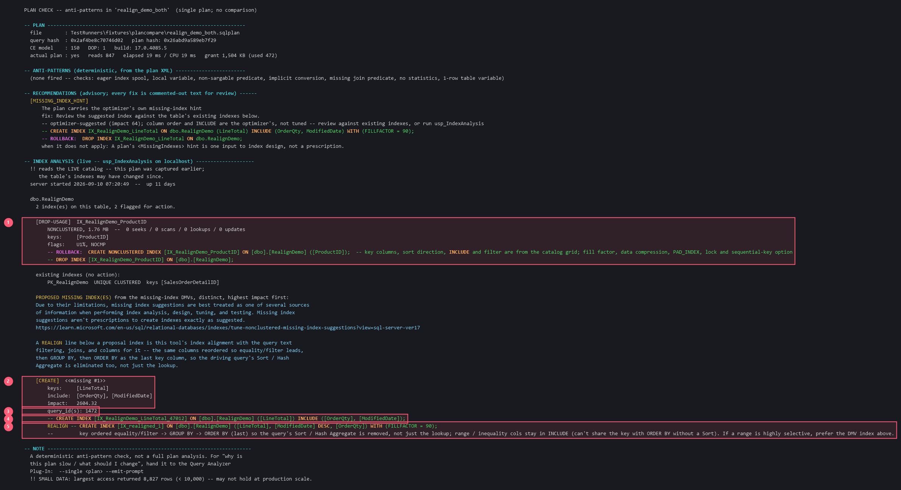

# Worked example -- the missing-index DMV proposes, the plan corrects it

SQL Server's missing-index suggestions are built from a query's *filters* and its *output
columns*. They do not consider `ORDER BY` or `GROUP BY` at all. So a suggestion can be perfectly
correct about which columns you need and still leave a Sort or a Hash Aggregate standing in the
plan -- it removed the lookup and stopped there.

This example shows the suggestion, and then the same columns reordered so the sort goes too.
Unlike [the offline example](EXAMPLE-OfflineIndexAnalysis.md), this one reads the live catalog and
Query Store: the correction needs to know which query drove the proposal.

## The query

```sql
CREATE OR ALTER PROCEDURE dbo.RealignDemo_Both @lt MONEY AS
BEGIN
    SET NOCOUNT ON;
    SELECT   OrderQty, ModifiedDate, COUNT_BIG(*) AS n
    FROM     dbo.RealignDemo
    WHERE    LineTotal = @lt          -- equality filter
    GROUP BY OrderQty, ModifiedDate   -- grouping
    ORDER BY ModifiedDate DESC;       -- and a final order
END;
```

An equality filter, a grouping and an ordering -- three different demands on one index.

```bash
python ComparePlans_v1.py --single realign_demo_both.sqlplan \
       --analyze-indexes localhost --utility-db DBAdmin \
       --realign-missing-indexes
```



## What it found

1. **A dead index, unrelated to your query.** `IX_RealignDemo_ProductID` is 1.76 MB serving
   **0 seeks, 0 scans, 0 lookups and 0 updates** -- pure maintenance cost. Your plan never touches
   `ProductID`, so nothing in the plan could have revealed it; it comes from the usage DMVs, and
   it comes with a reconstructed `CREATE` so the drop is reversible.
2. **The proposal from the missing-index DMVs:** key `[LineTotal]`, `INCLUDE (OrderQty,
   ModifiedDate)`, impact 2604.32. Correct as far as it goes -- it covers the query and removes
   the lookup. What it cannot be is complete: the optimizer builds these from a query's *filters*
   and *output columns* only, so `ORDER BY` and `GROUP BY` never enter into it. The impact figure
   is cumulative across every execution the DMV has seen, which is also why it resets when the
   instance restarts, and when any `CREATE` or `DROP INDEX` touches this table.
3. **`query_id(s): 1447` -- which query asked for it.** This is the Query Store bridge, and it is
   the thing that makes the correction below possible: without knowing the driving query, there is
   no way to know what it sorts by.

   The missing-index DMVs cannot tell you this on their own. On SQL Server 2019+
   `sys.dm_db_missing_index_group_stats_query` will link a proposal to a query, but it gets you
   only as far as the **plan cache** -- and a cached plan is invalidated by any `CREATE` or
   `DROP INDEX` on the table, which is exactly the change you are weighing up, as well as by a
   restart or memory pressure. A Query Store `query_id` survives all of that, and it names a
   *stored* plan, which is what can still be shredded for the Sort the realignment below is built
   from.
4. **The DMV's own `CREATE`, verbatim.** Build this and the key lookup disappears. The
   `GROUP BY` and `ORDER BY` still need a Sort, because nothing in the suggestion addresses them.
5. **`REALIGN` -- the same three columns, reordered.**

```sql
-- the DMV's suggestion
CREATE INDEX ... ON dbo.RealignDemo ([LineTotal]) INCLUDE ([OrderQty], [ModifiedDate]);

-- realigned
CREATE INDEX ... ON dbo.RealignDemo ([LineTotal], [ModifiedDate] DESC, [OrderQty]);
```

`ModifiedDate` is promoted out of `INCLUDE` into the key, **with its `DESC` direction**, and
`OrderQty` follows it. The filter still leads, so the seek is unchanged -- but the rows now arrive
already in the order the query wants, and the Sort is gone as well as the lookup.

## The detail worth pausing on

The key order did not come from reading the SQL text. Read naively, `GROUP BY OrderQty,
ModifiedDate` would suggest `OrderQty` first. The tool reads the **plan's own Sort operator**,
which in this plan is:

```
OrderBy: ModifiedDate   Ascending=0     <- DESC
OrderBy: OrderQty       Ascending=1
```

The optimizer satisfied the grouping and the final ordering with a *single* sort on
`(ModifiedDate DESC, OrderQty)` -- the ordering column leads because `GROUP BY` does not care what
order its columns come in but `ORDER BY` does -- and the realigned key matches that exactly. Had
the tool trusted the query text it would have produced a key in the wrong order and the Sort would
have survived. **The plan is ground truth; the text is a description of intent.**

## If your own GROUP BY gets no realignment

Nothing above used a query hint, and that matters: the realignment you just saw is what plain
T-SQL produces. It works here because the query's own `ORDER BY` forces a sort that the grouping
can share, so the optimizer uses a Stream Aggregate and records the grouping columns in the plan
as `<GroupBy>`, where the tool can read them.

Most grouping queries have no `ORDER BY`. Those hash -- and a `Hash Match (Aggregate)` writes **no
`<GroupBy>` at all**, keeping its grouping columns in `<HashKeysBuild>` instead. The tool then sees
no grouping, and offers no realignment. (ComparePlans flags exactly this as
`HASH_AGG_HIDES_GROUPING`, so you are told rather than left wondering.)

`OPTION (ORDER GROUP)` is how you see what you are missing -- as a diagnostic, not as a fix.
Measured on this table:

| | plan | Sorts | subtree cost | grouping visible? |
|---|---|---|---|---|
| no hint, no index | `Hash Match <- Scan` | 0 | 1.040 | **no** |
| `OPTION (ORDER GROUP)` | `Stream Aggregate <- Sort <- Scan` | 1 | 1.283 | yes |
| no hint, realigned index built | `Stream Aggregate <- Index Seek` | 0 | **0.054** | yes |
| `ORDER GROUP` + that index | *identical to the row above* | 0 | 0.054 | yes |

Read the second and third rows together. The hint **on its own is a pessimization** -- it forces a
Sort that was not there, costing 23% here. The index is the fix, and it is 19x cheaper than the
hash plan. And once the index exists the hint does nothing at all: rows three and four are the same
plan to the digit, because the index already delivers the rows in order.

So use it as a diagnostic and take it back out:

```sql
SET SHOWPLAN_XML ON;   -- nothing executes; this only compiles
GO
SELECT OrderQty, ModifiedDate, COUNT_BIG(*) AS n
FROM   dbo.YourTable
WHERE  SomeColumn = 4.99
GROUP  BY OrderQty, ModifiedDate
OPTION (ORDER GROUP);  -- forces a Stream Aggregate, so the plan records <GroupBy>
GO
SET SHOWPLAN_XML OFF;
```

Pass that plan to `usp_IndexAnalysis @StatementPlanXml = N'<the plan>'`, read the realigned key,
build it -- then drop the hint. The shipped statement never needs it.

## Two impact numbers, two different scales

The plan's own hint reports `impact 64`; the DMV proposal reports `2604.32`. They are not
comparable and neither is a percentage of the other. A plan hint's impact is the optimizer's
estimated improvement for that one compilation; a DMV proposal's is cumulative across every
execution it has seen. **Rank proposals against each other within one source, never across.**

## What the tool says about its own advice

The section carries Microsoft's own caution, not this project's paraphrase of it: missing-index
suggestions *"aren't prescriptions to create indexes exactly as suggested"*, and are best treated
as one input among several. The REALIGN line is one more input, not a prescription either -- it
assumes the driving query is the one worth optimising for, and on a table serving many queries
that is a judgement only a person can make.

Everything above is commented-out text. Nothing was created, altered or dropped.

> **About the input.** The `.sqlplan` used here is one of this project's test fixtures, which are
> apparatus for its own equivalence gates and are not part of this release. The output above is
> real, not mocked. To follow along on your own query, capture an **actual** plan -- in SSMS,
> Ctrl+M then run and save the plan, or `SET STATISTICS XML ON;` and save the XML with a
> `.sqlplan` extension. An estimated plan is rejected: the analysis needs runtime numbers.

Back to [USAGE-ComparePlans_v1.md](USAGE-ComparePlans_v1.md) ·
[USAGE-IndexAnalysis_v1.md](USAGE-IndexAnalysis_v1.md).
