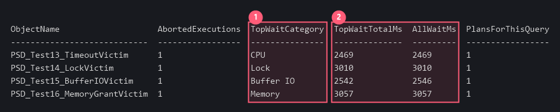
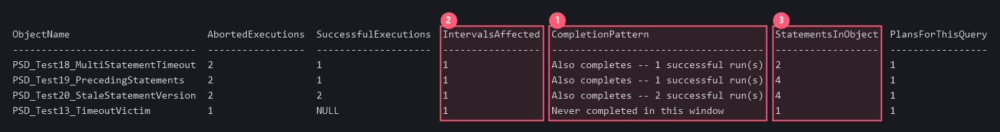

# Worked example -- four timeouts, four different causes

A client timeout looks the same from the application every time: the call took too long and the
caller gave up. What made it slow is the part that matters, and it is not in the error message.

This example runs four statements that are each aborted by a client at three seconds, and shows
the finder attributing each one to a *different* reason. Everything below is real output from
this project's own fixtures against `AdventureWorks2019`.

## How the four aborts were produced

A statement cannot abort itself this way -- `execution_type = 3` means a **client** gave up -- so
each case needs a client with a short timeout and a server-side condition to run into:

| Fixture | The condition created before the victim runs |
|---|---|
| `PSD_Test13_TimeoutVictim` | **CPU starvation.** Ten `PSD_Test13_CpuHog` sessions saturate a 4-vCPU box, so an ordinary CPU-bound query never gets enough scheduler time. |
| `PSD_Test14_LockVictim` | **Blocking.** A concurrent session holds an exclusive lock in an open transaction. The victim reads with `READCOMMITTEDLOCK`, because RCSI is on here and a plain reader would take the row version and return. |
| `PSD_Test15_BufferIOVictim` | **Cold cache.** `DBCC DROPCLEANBUFFERS` immediately before, so the pages must come from disk. |
| `PSD_Test16_MemoryGrantVictim` | **Memory-grant queueing.** Five sessions each take a workspace-memory grant, exceeding the resource semaphore, so the victim waits on `RESOURCE_SEMAPHORE` without ever executing. |

Each victim is then called with `sqlcmd -t 3`, which is the client giving up.

```sql
EXEC dbo.usp_FindTimeoutStatementsNQueryStore
     @DatabaseName     = 'AdventureWorks2019',
     @TargetObjectName = 'PSD_Test13_TimeoutVictim';   -- once per fixture, for this table
```

## What the finder reports



1. **Four aborts, four different `TopWaitCategory` values.** This is the whole point of the tool.
   All four are "the query timed out" as far as the application is concerned; CPU starvation,
   blocking, cold cache and memory-grant queueing need four different responses, and three of
   them are not fixed by touching the query at all.
2. **`TopWaitTotalMs` lands just under each three-second client timeout, and `AllWaitMs` is
   almost identical to it.** That closeness is the evidence the category is the *whole* story for
   that statement rather than one wait among several -- where they diverge, the named category is
   only part of what the statement was waiting on. (Test 15 shows a small gap: 2,542 of 2,546 ms.)

The one to be careful with is CPU. A statement starved of scheduler time reports `CPU` because
that is what it is waiting for -- but the fix is the other ten sessions, not this query.

## Counting, and what the numbers do not mean



1. **`CompletionPattern` separates "broken" from "sometimes fine".** `Also completes -- 1
   successful run(s)` means the same statement succeeded inside the same window; `Never completed
   in this window` means it did not once. An intermittent timeout and a statement that always
   fails are different problems, and the abort count alone cannot tell them apart.
2. **`IntervalsAffected` is the honest denominator, and it is why `AbortedExecutions` is not a
   count of incidents.** Query Store holds one runtime-stats row per (plan, execution type,
   interval). Measured on this instance: twelve aborts eight seconds apart collapsed to **two**
   rows, while ten aborts seventy-five seconds apart produced ten. At the default 30-60 minute
   interval, a burst of aborts and a steady trickle can report the same number.
3. **`StatementsInObject` warns you the object holds more than one statement.** Four of them for
   Tests 19 and 20. The row names the statement that was aborted, which is not necessarily where
   the caller's time went -- see `PctDurationBeforeAbortedStmt` and `PrecedingStatementsAvgMs` in
   the main document for the columns that quantify that.

## `NextStep` -- the column that tells you to stop

`NextStep` is a long text column, left out of the grids above to keep them readable. For all four
of these rows it says:

```
Single plan -- a timeout here is less likely to be parameter sniffing
```

That is the handover decision, and here it is a decision **not** to hand over. Each of these
fixtures has `PlansForThisQuery = 1`: one plan, reused, and it timed out. Parameter sniffing is a
story about the *wrong plan of several* being reused, so with a single plan there is nothing for
stage 2 to compare and the answer is the wait category, not the plan. A genuine sniffing candidate
shows more than one plan, and `NextStep` then carries the `query_id` to pass to
`usp_ParameterSniffingDiagnostic`.

Reading the tool correctly includes reading it when it tells you to go no further.

> **About the input.** The `PSD_Test*` procedures are this project's own timeout fixtures, which
> are apparatus for its equivalence gates and are not part of this release. The output above is
> real, not mocked. On your own instance, run the finder with no `@TargetObjectName` and it will
> report whatever statements callers have actually abandoned in the lookback window.

Back to [USAGE-FindTimeoutStatements_v1.md](USAGE-FindTimeoutStatements_v1.md).
