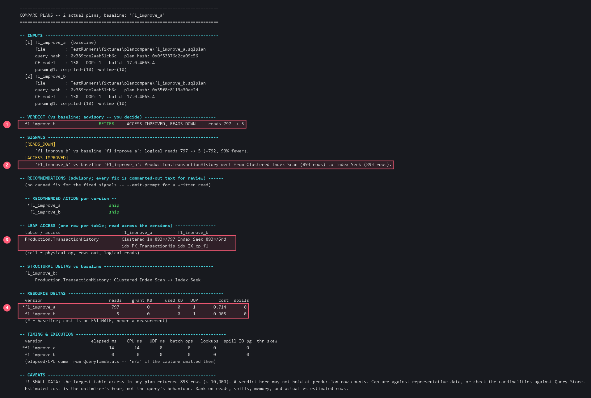
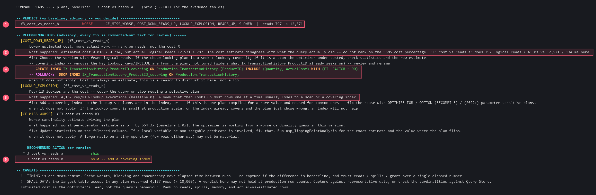
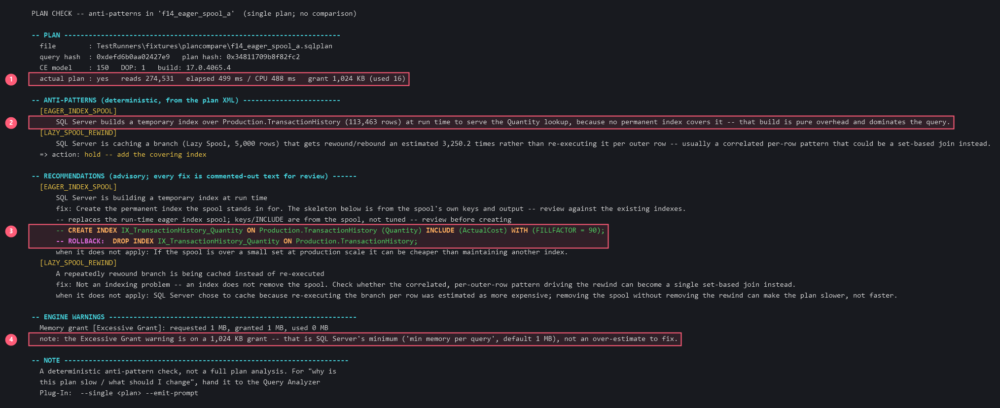

# Comparing query plans during development

`ComparePlans_v1.py` takes 2 to 4 **actual** execution plans for one query -- the
version you have and the version(s) you are trying -- and tells you which is better
and why, before the change ships. It reads plan files only: no database connection,
no Query Store, nothing installed on a server.

The verdict is advisory. You read it and decide.

---

## Before you start -- prerequisites

| # | You need | How to check | If missing |
|---|---|---|---|
| 1 | **Python 3.8 or newer** on your PATH | `python --version` in a terminal prints `Python 3.x` | Install from python.org, or use whatever standard Python build your organisation provides. |
| 2 | **This repository** on your machine | `ComparePlans_v1.py` is in the folder you downloaded | Clone or download the repository. |
| 3 | **`plan_extract.py`** next to it | same folder as `ComparePlans_v1.py` | It ships in the repo. If it is gone, re-pull. |
| 4 | **SSMS 18/19/20** *or* Azure Data Studio, to capture plans | -- | -- |
| 5 | Permission to run your query with **actual execution plan** on | You can already run the query | Actual-plan capture executes the query. For a data-changing query, wrap it in a transaction you roll back. |

Nothing to `pip install`. The tool uses the Python standard library only.

---

## Step 1 -- capture the plans

You need one `.sqlplan` file per version of the query. **It must be an *actual*
plan** (the query really ran and the plan carries the row counts and timings). An
*estimated* plan is rejected by the tool.

### Option A -- SSMS, mouse

1. Open a query window, paste **version 1** of your query.
2. Press **Ctrl+M** (Query -> Include Actual Execution Plan). The button stays lit.
3. Run the query. When it finishes, click the **Execution plan** tab.
4. Right-click anywhere on the plan -> **Save Execution Plan As...** -> save as
   `v1.sqlplan`.
5. Repeat for version 2 (`v2.sqlplan`), and up to two more.

### Option B -- `SET STATISTICS XML ON`, script

Run this, then save the single-column XML result to a file:

```sql
SET STATISTICS XML ON;
-- your query here, exactly as it will run (same parameters)
SET STATISTICS XML OFF;
```

The last result grid holds a value starting with `<ShowPlanXML ...>`. Click the
cell, and save it as `v1.sqlplan`. In SSMS: right-click the cell -> **Save Results
As**, or open the cell (the XML opens in a new tab) and **File -> Save As**.

### Getting a useful comparison

- Run every version with the **same parameter values**. A plan is only as
  representative as the values it ran with.
- Capture against data that looks like production. On a small dev database the tool
  will warn you (`SMALL DATA`) that the verdict may not scale.
- For parameter-sniffing checks: capture the **same** query run for 2-4 different
  parameter values (see the `--emit-prompt` example below).

---

## Step 2 -- run the tool

```bash
cd /path/to/this/repository
python ComparePlans_v1.py v1.sqlplan v2.sqlplan
```

Give the versions names so the report reads clearly:

```bash
python ComparePlans_v1.py "current=v1.sqlplan" "covering index=v2.sqlplan" "rewritten join=v3.sqlplan"
```

The **first** plan is the baseline everything else is measured against. To pick a
different one:

```bash
python ComparePlans_v1.py v1.sqlplan v2.sqlplan --baseline "v2"
```

### Output formats

`--full` restores the evidence tables the brief report leaves out -- inputs, signals, leaf access,
structural deltas, resource deltas and timing. The example below is the simplest case there is:
**the same query text captured twice**, with an index created in between.

```sql
-- both captures run exactly this
SELECT TransactionID, Quantity, ActualCost
FROM   Production.TransactionHistory
WHERE  Quantity = 10;

-- created between capture A and capture B
CREATE NONCLUSTERED INDEX IX_cp_f1
    ON Production.TransactionHistory (Quantity) INCLUDE (ActualCost);
```

Identical text means an identical query hash, so only the *plan* hash moves -- visible in the
INPUTS block at the top.



**What the tool determined, and why:**

1. **`BETTER`, reads 797 -> 5.** A 99% reduction, stated as a measurement rather than a percentage
   of an estimate.
2. **`ACCESS_IMPROVED` -- Clustered Index Scan became Index Seek**, and the signal is reads-aware:
   a scan turning into a seek is only an improvement if the reads actually fall. A seek that then
   performs thousands of lookups would have fired `LOOKUP_EXPLOSION` instead, as in the first
   example above.
3. **LEAF ACCESS, one row per table across both versions** -- physical operator, rows out, logical
   reads, and which index was used (`PK_TransactionHis` -> `IX_cp_f1`). This is the table to read
   when a verdict surprises you.
4. **RESOURCE DELTAS** -- and note `cost 0.714 -> 0.005` sits in the same table as `reads 797 -> 5`
   but is marked an ESTIMATE. Here the cost happens to agree with reality. The first example is
   what happens when it does not.


| Flag | Use |
|---|---|
| *(none)* | The **brief** text report -- verdict, recommendations (each with a `what happened:` line in plain language), recommended action, caveats. Colour is **auto** (on to a terminal, off when piped). |
| `--full` | Add back `INPUTS`, `SIGNALS`, and the leaf-access / structural / resource / timing tables -- the long report, and the one to forward as evidence. |
| `--color always` / `--color never` | Force ANSI colour on / off for `--format text`. `never` when a wrapper mangles escapes; `always` to keep colour through a pager. Ignored for `md` / `json` / `--emit-prompt`. Honours `NO_COLOR`. Scheme: section rules cyan, `[CODE]` yellow, verdict green/red/yellow, action verbs coloured; generated `CREATE INDEX` / `DROP INDEX` lines green with **T-SQL keywords in light orange**, and the **`-- ROLLBACK:` label magenta + bold** so the undo stands apart. |
| `--format md` | Markdown -- paste into Confluence, a PR, or Teams. The `**bold**` / `` `code` `` markers only render in a Markdown viewer, not a raw terminal. |
| `--format json` | Structured, for scripting. Nothing consumes it yet. |
| `--no-recommendations` | Omit the RECOMMENDATIONS section -- v1.1-shaped output. |
| `--dump-catalog` | Print the fix catalog (`ComparePlans-Recommendations-Catalog.md`) and exit. |
| `--emit-prompt` | Appends a ready-made prompt plus each plan's digest, to paste into a Claude Code or GitHub Copilot CLI session for a written analysis (see below). |
| `--analyze-indexes SERVER` | After a `CREATE INDEX` is generated -- or, with `--single`, if the plan carries the optimizer's `<MissingIndexes>` hint -- connect to `SERVER` and run `usp_IndexAnalysis` for that table, appending its full index picture (see below). Opt-in; without it the tool never connects. |
| `--auth windows` / `entra` / `entra-interactive` | Auth mode for `--analyze-indexes`. Default `windows`. No password option exists. |
| `--utility-db NAME` | Database holding `usp_IndexAnalysis` (default `DBAdmin`). Set this if the procedures were installed somewhere else -- otherwise `--analyze-indexes` looks in `DBAdmin`, finds nothing, and the section comes back as a non-fatal failure. |
| `--min-uptime-days N` | Warn in the `INDEX ANALYSIS` section when the instance has been up fewer than `N` days (default 7). |
| `--show-missing-indexes` | With `--analyze-indexes`, also list `usp_IndexAnalysis`'s missing-index DMV proposals for the table, under a caveat + a Microsoft-docs link that they are a hint, not a prescription. Off by default (workload-volatile). |
| `--realign-missing-indexes` | **`--single` only.** Under each missing-index proposal, add a `REALIGN -- CREATE INDEX` line with the key reordered **filter -> GROUP BY -> ORDER BY (last)**, so the same index also removes the query's Sort / Hash Aggregate. Implies `--show-missing-indexes`. Refused in a 2-4 plan comparison (exit 2). Reads `usp_IndexAnalysis`'s `missing_order_by_cols` / `missing_group_by_cols` / `missing_window_kind`. When the driving query ran a **window function**, the caveat names the key a windowing POC index (`missing_window_kind` = `FPOC` with a WHERE filter, `POC` without -- `PARTITION BY` surfaces through the plan's `Segment` operator, which the GROUP BY shred reads; `OVER (PARTITION BY ...)` itself is not parsed). An **unfiltered** window function raises no missing-index hint -- `--single` then emits a `WINDOW_FN_NO_INDEX` advisory (see the anti-pattern table). |
| `--fill-factor N` | `FILLFACTOR` for every generated `CREATE INDEX` (default 90; `0` or `100` omits the `WITH (FILLFACTOR = N)` clause). |

---

## Step 3 -- read the verdict

The default `--format text` report is brief -- verdict, recommendations, one recommended action
per version, caveats. Under `--color` it is also the only output in this toolset that uses colour
to carry meaning: yellow signal tags, green generated DDL with **orange T-SQL keywords**, and the
paired rollback in magenta so the undo is impossible to miss.

### Worked example -- the same plan, good for one parameter and ruinous for another

One procedure, run twice with the *same* runtime parameter. Only the value it was **compiled** for
differs:

```sql
CREATE OR ALTER PROCEDURE dbo.cp_f3_sniff @pid INT AS
SELECT TransactionID, Quantity, ActualCost
FROM   Production.TransactionHistory
WHERE  ProductID = @pid
ORDER BY TransactionID;

-- capture A: compiled AND run for a COMMON value
EXEC sp_recompile 'dbo.cp_f3_sniff';
EXEC dbo.cp_f3_sniff @pid = 870;          -- <- plan A captured here

-- capture B: compiled for a RARE value, then run for the common one
EXEC sp_recompile 'dbo.cp_f3_sniff';
EXEC dbo.cp_f3_sniff @pid = 725;          -- rare: caches a seek + lookup plan
EXEC dbo.cp_f3_sniff @pid = 870;          -- <- plan B captured here, reusing it
```

That is parameter sniffing in eight lines: B is the plan the optimizer built for 725, doing the
work of 870.



**What the tool determined, and why:**

1. **`WORSE`, reads 797 -> 12,571.** The verdict ranks on work done, not on the optimizer's
   opinion of it.
2. **The inversion that matters: estimated cost `0.018` against `0.714`, actual reads `12,571`
   against `797`.** Plan B looks sixteen times *cheaper* and does sixteen times more reading. Rank
   these two in SSMS by "query cost relative to the batch" and you pick the bad one -- which is
   why the report says, in as many words, not to.
3. **`4,187` key/RID-lookup executions against a baseline of 0** -- the mechanism. The seek is
   genuinely selective for `ProductID = 725`; reused for 870 it finds thousands of rows and looks
   each one up individually.
4. **The fix, synthesised from the plan itself** -- keys from the seek, `INCLUDE` from the lookup's
   own output -- with its `-- ROLLBACK:` on the next line. Both are commented out; nothing here
   runs DDL.
5. **`hold -- add a covering index`.** Note it does not say "use `OPTION (RECOMPILE)`": covering
   the query removes the *lookup*, which is what made the two parameter values want different
   plans in the first place, so both converge on the same good plan.

The default report is **brief** -- four sections. `--full` adds the rest.

```
-- VERDICT (vs baseline; advisory -- you decide) ----------------------------
  covering index               BETTER   + ACCESS_IMPROVED, READS_DOWN  |  reads 797 -> 5
```

- **BETTER / WORSE / MIXED / ~ SAME** -- the tally of improvement vs regression
  signals for that version.
- **RECOMMENDATIONS** -- for each fired signal and each detected anti-pattern:
  the headline, a **`what happened:`** line that puts the plan's own numbers into
  plain language (rows scanned, key lookups, `'<best>' does N reads / M ms vs
  …here`), the fix, a commented-out `CREATE INDEX` where the plan supplies one,
  and a "when this does not apply" line.
- **`RECOMMENDED ACTION` per version** -- `ship` / `hold -- <fix>` /
  `investigate -- <what>`.
- **CAVEATS** -- always read these.

With **`--full`** you also get, before the recommendations:

- **SIGNALS** -- every fired signal with the numbers behind it (the brief report
  folds the relevant ones into the recommendation `what happened:` lines).
- **LEAF ACCESS** -- per table, how each version reads it (operator, rows,
  logical reads) -- read across the columns.
- **STRUCTURAL DELTAS** -- join / sort / spool / parallelism shape changes.
- **RESOURCE DELTAS** -- reads, memory grant, DOP, estimated cost, spills.
- **TIMING & EXECUTION** -- elapsed and CPU ms, scalar-UDF ms, batch-mode
  operator count, key/RID-lookup executions, tempdb pages moved by spills, worst
  parallel-thread row skew.

Everything in the RECOMMENDATIONS section is advisory -- nothing is runnable
as-is. `--no-recommendations` drops the section and implies `--full`
(v1.1-shaped output). `md` and `json` are always the full report.

### What the signals mean

| Signal | Meaning |
|---|---|
| `COST_DOWN_READS_UP` | A version has a lower estimated cost but does **more** actual reads. The classic "the SSMS cost percentage lied" trap. |
| `SLOWER` / `FASTER` | Actual elapsed time moved by 30%+ (and at least 50 ms). Needs `QueryTimeStats` in the plan; one measurement -- re-capture if borderline. |
| `NEW_SPILL` / `SPILL_RESOLVED` / `SPILL_GREW` | A sort/hash spill to tempdb appeared / went away / (both spill, but this one moves 2x+ the tempdb pages). |
| `GRANT_GREW` / `GRANT_SHRANK` | Memory grant changed by 2x or more. |
| `GRANT_OVERALLOCATED` | A version is granted 4x+ what it uses (and at least ~5 MB) while the baseline is not. Over-grant reserves memory other queries then cannot get. |
| `CE_MISS_WORSE` | The optimizer's row estimate is further off (cardinality guess got worse). |
| `ACCESS_REGRESSED` / `ACCESS_IMPROVED` | A table went seek -> scan / scan -> seek, and the read count agrees it is worse / better. |
| `LOOKUP_EXPLOSION` | 1,000+ key/RID-lookup executions, and 2x+ the baseline. A seek that then looks up most rows one at a time usually loses to a scan or a covering index. |
| `BATCH_MODE_LOST` / `BATCH_MODE_GAINED` | The version dropped / picked up batch-mode execution versus the baseline. |
| `THREAD_SKEW` | On a parallel plan, the busiest worker did 10x+ the rows of the quietest (and worse than the baseline). Parallelism is not buying what the DOP suggests. |
| `UDF_TIME_UP` / `UDF_TIME_DOWN` | Scalar-UDF elapsed time moved by 30%+ (and 50 ms). Inlining or removing a scalar UDF is often the whole win. |
| `UDF_DOMINATES` | Advisory -- a scalar UDF is 50%+ of a plan's elapsed time. |
| `READS_UP` / `READS_DOWN` | Total logical reads moved by 30% or more (and at least 500 reads). |
| `IDENTICAL_PLAN` | Two versions compiled to the same plan. Any runtime difference is data or parameters, not the plan. |
| `QUERY_HASH_MISMATCH` | The versions are not the same query text. The tool does **not** check they return the same results -- that is on you. |

### Anti-patterns the RECOMMENDATIONS section detects (v1.2)

Read straight from the plan XML, independent of the comparison:

| Detection | Meaning |
|---|---|
| `LOCAL_VARIABLE` | A `@`-variable in a predicate with no sniffed value -- the optimizer used a fixed guess, not the histogram. **Names the actual variable** (`@pid`, or `@a, @b`). Fix: parameter / `OPTION (RECOMPILE)` / a constant / run `usp_TippingPointAnalysis`. |
| `TABLE_VARIABLE_1ROW` | A table variable estimated at 1 row feeding a join (thousands of rows in reality). **Names the actual variable** (`@t`). Fix: switch it to a `#temp` table, or `OPTION (RECOMPILE)`. Capture the final `SELECT`'s plan only (a table variable can't span batches); at compat 150+ add `OPTION (USE HINT('DISABLE_DEFERRED_COMPILATION_TV'))` so the 1-row estimate survives -- fixture `f19_tablevar_1row`. |
| `NO_JOIN_PREDICATE` | A join with no `ON` condition -- an unintended cross join multiplies row counts. Fix: add the predicate. Fixture `f18_no_join_pred`. |
| `NO_STATISTICS` | The optimizer had no statistics on a filtered column. Fix: `CREATE STATISTICS`, or let auto-create run. *(A live `<ColumnsWithNoStatistics>` warning is rare with the SQL Server 2019/2022 default CE; fixture `f20_no_statistics` is hand-built.)* |
| `WINDOW_FN_NO_INDEX` | *(`--single` + `--analyze-indexes` only.)* The plan ran a window function (`Sequence Project` / `Segment` / `Window Aggregate`) with a Sort and **no** `<MissingIndexes>` hint -- i.e. an unfiltered `OVER (PARTITION BY ...)`. A commented POC `CREATE INDEX` (key = the window Sort's columns verbatim: `PARTITION BY` then frame `ORDER BY`, ASC/DESC from the plan; INCLUDE = the scanned columns) **is synthesised** from the plan's own Sort, with its paired `-- ROLLBACK:  DROP INDEX`. Review and rename before creating. Fixture `f21_window_nofilter`. |
| `NON_SARGABLE_PREDICATE` | A function / `CONVERT` on the filtered column inside a scan -- an index on it cannot seek. The `what happened:` line carries the predicate text. Fix: compare on the native type, or a persisted computed column. |
| `IMPLICIT_CONVERSION` | A `PlanAffectingConvert` warning -- a type mismatch is converting the column and changing the plan. Fix: align the parameter / literal type. |
| `EAGER_INDEX_SPOOL` | SQL Server is building a temporary index at run time. Emits the commented `CREATE INDEX` from the spool's own keys and output, with its paired `DROP INDEX`. |
| `LOOKUP_EXPLOSION` | A seek followed by thousands of key/RID lookups. When the optimizer emitted no missing-index request, the tool **synthesises the covering `CREATE INDEX`** from the seek's keys + the lookup's output columns, with its paired `DROP INDEX`. |
| `NO_JOIN_PREDICATE` | A join with no `ON` -- an unintended cross join. |
| `NO_STATISTICS` | The optimizer had no statistics on a filtered column. |
| `ROW_GOAL` | A `TOP` / `FAST N` / `EXISTS` row goal on some versions but not others -- reads and the seek/scan choice are not comparable like-for-like. |

The full fix text for every code is in **`ComparePlans-Recommendations-Catalog.md`**
(generated -- `python ComparePlans_v1.py --dump-catalog`).

The tool **rejects the whole run** if any file is not a valid actual plan, and
prints which one and why.

---

## Check a single plan (`--single`)

### Worked example -- the index SQL Server builds for you, every time it runs

A correlated subquery against a column with no index on it:

```sql
SELECT TOP (5000) th1.TransactionID,
       (SELECT TOP (1) th2.ActualCost
        FROM   Production.TransactionHistory th2
        WHERE  th2.Quantity = th1.Quantity      -- no index on Quantity
        ORDER BY th2.ActualCost DESC) AS TopCost
FROM   Production.TransactionHistory th1;
```



**What the tool determined, and why:**

1. **274,531 logical reads to return 5,000 rows**, in 499 ms. That ratio is the tell before any
   analysis.
2. **`EAGER_INDEX_SPOOL` -- SQL Server builds a temporary index over 113,463 rows at run time**,
   because no permanent index covers the `Quantity` lookup. It then throws it away and builds it
   again on the next execution. The build *is* the query's cost.
3. **The permanent index that spool stands in for**, with keys and `INCLUDE` taken from the
   spool's own definition rather than guessed, plus the rollback.
4. **A warning it tells you to ignore.** SQL Server reports `Excessive Grant: requested 1 MB,
   granted 1 MB, used 0 MB`, which reads like an over-estimate to chase. It is not: 1,024 KB is
   the server's *minimum* grant (`min memory per query`), so the engine could not have granted
   less. Flagging that is the difference between a checklist and a tool worth trusting.

There is no verdict or ranking here -- one plan has no baseline to be better or worse than.

You do not always have two plans to compare. `--single <plan>` runs just the
deterministic anti-pattern checks on **one** plan and stops:

```bash
python ComparePlans_v1.py --single C:\Temp\myplan.sqlplan
```

It reports:

- a **PLAN** header -- hashes, CE model, DOP, whether it is an actual plan,
  logical reads, elapsed / CPU, memory grant;
- **ANTI-PATTERNS** -- any of: eager index spool, local variable, non-sargable
  predicate, implicit conversion, missing join predicate, no statistics, 1-row
  table variable (named -- `@pid`, `@tv` -- where the plan gives a name), plus a
  one-line `=> action`;
- **RECOMMENDATIONS** -- the catalog fix for each, with the generated
  `-- CREATE INDEX` and its `-- ROLLBACK:` where the plan supplies one;
- **ENGINE WARNINGS** -- the plan's own warnings verbatim. If SQL Server flags an
  "Excessive Grant" on a grant of 1 MB or less, a `note:` line points out that is
  the minimum grant (`min memory per query`, default 1 MB), not an over-estimate
  to fix.

No verdict, no ranking -- there is no baseline. It is the checklist half. For
"why is this plan slow, what should I change", hand it to the plugin:

```bash
python ComparePlans_v1.py --single C:\Temp\myplan.sqlplan --emit-prompt > analysis-prompt.txt
```

`--analyze-indexes`, `--format md|json`, `--color`, and `--full` (adds the
`plan_extract` digest) all work in this mode. `--single` with `--no-recommendations`,
or with anything other than exactly one plan, is an error.

In `--single`, `--analyze-indexes` engages whenever the plan carries the
optimizer's own `<MissingIndexes>` hint -- not only for an eager index spool -- so
any single plan with a missing-index suggestion can be checked against the table's
existing indexes, and `--realign-missing-indexes` (see the flags table) will add
the reordered `REALIGN -- CREATE INDEX` line under each proposal whose driving
query also sorts or groups. When that driving query ran a window function the
REALIGN caveat labels the key `FPOC` (a WHERE filter is present) or `POC` (none);
an unfiltered window function produces no proposal, so `--single --analyze-indexes`
emits a `WINDOW_FN_NO_INDEX` advisory instead.

---

## Optional -- a written analysis from the plugin

`--emit-prompt` produces a block you paste into a session that has Erik Darling's
`sqlserver-query-plans` skill loaded (Claude Code or GitHub Copilot CLI -- see
that plugin's own setup documentation). It contains the comparison plus each plan's digest,
the v1.2 anti-pattern detections, and a pointer to
`ComparePlans-Recommendations-Catalog.md` so the model's advice does not
contradict the tool's; it asks the model to rank the versions and explain the
difference. Use it when the deterministic `RECOMMENDATIONS` section is not enough
or the plan is unusual -- v1.2 makes it the exception, not the default.

```bash
python ComparePlans_v1.py "pid=725=s725.sqlplan" "pid=319=s319.sqlplan" ^
    "pid=712=s712.sqlplan" "pid=870=s870.sqlplan" --emit-prompt > analysis-prompt.txt
```

In **GitHub Copilot CLI** (Windows Terminal, not the classic console):

```bash
copilot -p "$(cat analysis-prompt.txt)" --add-dir "/path/to/erikdarling-claude-plugins"
```

`--add-dir` points at wherever you installed Erik Darling's query-plan plugin; it is a separate
project, not part of this one, and the hand-off is optional.

In **Claude Code**: paste the file's contents into the session.

The model's answer is a second opinion, not a gate. The numbers in the tool's own
output are the record.

---

## Optional -- check the recommended index against the table (`--analyze-indexes`)

When the tool generates a `CREATE INDEX`, it has looked only at the plan in front
of it -- not at what indexes the table already has, who else reads them, or
whether one is a near-duplicate of the new one. `--analyze-indexes SERVER` closes
that gap: for every distinct table that got a generated index, it connects to
`SERVER`, runs `DBAdmin.dbo.usp_IndexAnalysis` for that table, and appends an
`INDEX ANALYSIS` section. "Recommend an index -> check the table for duplicates /
overlap / realignment -> decide" becomes one command.

The section is **reformatted for reading**, not a raw grid dump:

- the indexes `usp_IndexAnalysis` flagged (`DROP-DUP`, `DROP-USAGE`, `BLEND`,
  `REALIGN`, `CREATE`, ...) come first, each as a short block -- type, size,
  usage counts, key / include columns, its pros-and-cons flags, any
  `duplicate of` / `overlaps with`, and its commented `DROP` / `CREATE` text;
- **every `DROP` carries a `-- ROLLBACK:  CREATE INDEX` that reverses it**,
  reconstructed from the catalog grid (key columns, sort direction, `INCLUDE`
  and filter are preserved; fill factor, `DATA_COMPRESSION`, `PAD_INDEX`, lock and
  sequential-key options, and filegroup / partition placement are not -- diff
  against the live index first) so a drop can go through change control with its
  undo attached;
- then the indexes with no action recommended, one line each;
- then a `>>` cross-reference line whenever the index **this tool** just
  recommended re-leads an existing index -- e.g. "the recommended index
  `(ProductID)` is a key-prefix of existing `IX_x_ProductID` -- widen its
  `INCLUDE` rather than add a new index." That is the realign / BLEND call.

If the proc output cannot be parsed the raw text is shown instead, prefixed with
a note, so nothing is lost.

The comparison itself stays offline. Only this appended section is live, and it
**reads the catalog as it is now** -- the plans you compared were captured
earlier, so the table's indexes may have moved since. The section carries that
warning inline.

### Instance uptime

The section prints the SQL Server instance's start time and days of uptime, and
warns when uptime is under `--min-uptime-days` (default **7**). `usp_IndexAnalysis`'s
`DROP-USAGE` and `MISSING` findings come from cumulative DMV counters
(`sys.dm_db_index_usage_stats`, the missing-index DMVs) that **reset on every
service restart** and are cleared for a table by an `ALTER INDEX` or schema change
on it -- so shortly after a restart an index can look unused when it is not.
Rule of thumb: below a week, ignore the DROP/MISSING rows (duplicate and overlap
findings, from the index *definitions*, are still fine); a full business cycle
(~4 weeks, to include weekly and month-end work) makes the usage picture
representative. Azure SQL Database's own advisor waits 90 days of non-use before
suggesting a drop. If the login cannot read `sys.dm_os_sys_info` the uptime line
is silently skipped.

```bash
# local box, your Windows identity (the default)
python ComparePlans_v1.py v1.sqlplan v2.sqlplan --analyze-indexes localhost

# a domain- or Entra-joined SQL Server VM -- still integrated auth
python ComparePlans_v1.py v1.sqlplan v2.sqlplan --analyze-indexes sqlvm01.contoso.com

# Azure SQL Managed Instance -- Microsoft Entra, signed-in identity
python ComparePlans_v1.py v1.sqlplan v2.sqlplan ^
    --analyze-indexes myinstance.abc123.database.windows.net --auth entra

# force the Entra browser / device-code prompt (MFA)
python ComparePlans_v1.py v1.sqlplan v2.sqlplan ^
    --analyze-indexes myinstance.abc123.database.windows.net --auth entra-interactive
```

Rules:

- **No password, ever.** There is no `-P` / `--password` / connection-string
  option. Auth is `sqlcmd -E` (Windows / Kerberos) or `sqlcmd -G` (Entra), always
  under your own identity -- the same rule the rest of the family follows. The
  server name is validated (host / FQDN / `host\instance` / `tcp:host,port`);
  anything that could smuggle a second switch is rejected before any connection.
- `usp_IndexAnalysis` must be deployed in `--utility-db` (default `DBAdmin`) on
  `SERVER`, and the target database from the plan must exist there.
- **Failure is non-fatal.** `sqlcmd` missing, server unreachable, proc not
  deployed, proc error -> the section shows the error, a one-line note goes to
  stderr, and the run still exits `0`. The plan comparison above it is untouched.
- `--emit-prompt`, `--format md` and `--format json` all carry the section
  (`json` as an `index_analysis` map).

---

## Limits

- Actual plans only. Estimated plans are rejected.
- One statement per file -- capture the single query, not a whole procedure or batch.
- 2 to 4 plans per run.
- Does not verify the versions are equivalent queries.
- A small dev dataset can produce a verdict that does not hold at production scale --
  the tool warns, it cannot fix it.
- **v1.2 recommendations are a lookup table.** A signal that fires with no
  catalog entry still shows under `SIGNALS` -- it just has no canned fix. That is
  the `--emit-prompt` case. The generated `CREATE INDEX` text is a starting point
  from the plan's own columns, never a tuned recommendation -- review it, or run
  `usp_IndexAnalysis`.
- Validated on SQL Server 2025, database compatibility 150. Plan XML is stable back
  to SQL Server 2016; other versions are not yet formally tested.
